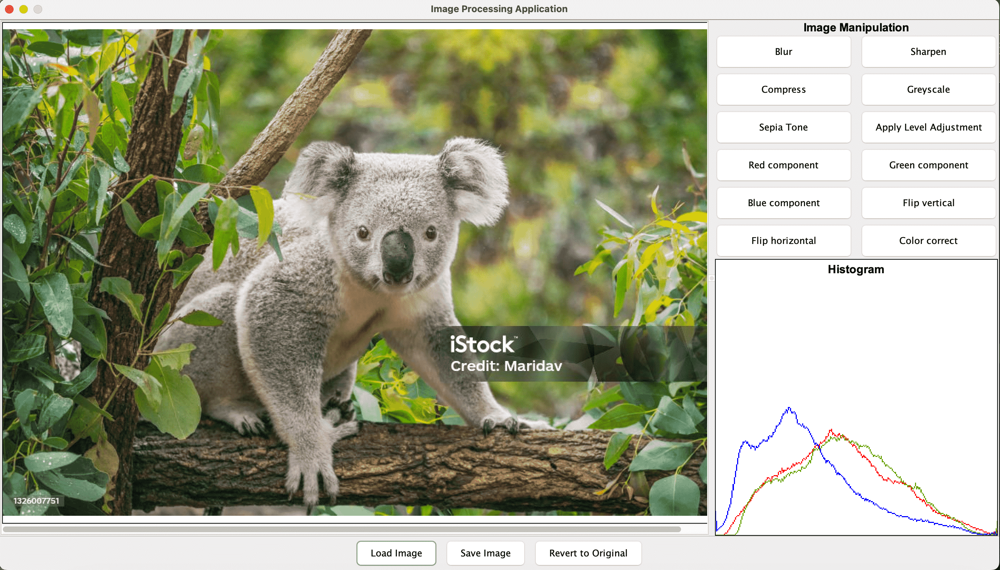

# ImageEditor
### Image manipulation application built using Java

## How to Use the Program

### Compilation (if required)
```bash
javac controller/*.java
```

### Execution
The JAR file is located at `res/ImageEditor.jar`.

- **GUI Mode:**
```bash
java -jar ImageEditor.jar
```

## Graphical User Interface



When invoked, the program will open the graphical user interface...


- **Interactive Mode:**
```bash
java -jar ImageEditor.jar -text
```
In interactive mode, type each command separately and type `exit` to quit.

- **Script Mode:** 
```bash
java -jar ImageEditor.jar -file res_script.txt
```

To run the script file (provide the exact location of the text file).

## Image Processing Application Overview
An image processing application that has the functionality to apply specified image processing operations, modify, and store the resulting image in PPM, JPG, or PNG formats.

## Classes and Interfaces

### Interfaces:
- **ScriptProcessor:** Processes command arguments and executes commands from script files. Located in the `controller` package.
- **ImageOperation:** Base interface for various image operations. Located in the `model` package.

### Classes:

#### Package: Controller
- **ImageUtil:** Methods for reading and writing images in PPM, JPG, and PNG.
- **CommandExecutor:** Controller for image processing commands.
- **ImageStorage:** Manages storage and retrieval of images.
- **RunScript:** Executes script commands.

#### Package: Model

##### Enums:
- **Channel:** Value, Luma, Intensity.
- **Color:** Red, Blue, Green components.
- **Direction:** Flip Horizontal, Vertical.
- **Filter:** Blur, Sharpen.
- **Intensity:** Brighten, Darken.

##### Classes:
- **AbstractColor:** Base for color transformation operations.
- **AbstractFilter:** Base for filter-based operations.
- **AdjustIntensity:** Brightens or darkens the image.
- **Blur:** Applies a blur effect.
- **CombineImages:** Combines image components.
- **Flip:** Flips the image.
- **Pixel:** Represents a single pixel.
- **Image:** Represents an image.
- **Sepia:** Applies sepia transformation.
- **SplitComponents:** Splits an image into components.
- **ValueIntensityLuma:** Finds value, intensity, and luma.
- **VisualizeComponents:** Visualizes color components.
- **ColorCorrect:** Performs color correction.
- **VisualizeHistogram:** Visualizes histograms.
- **AdjustLevel:** Adjusts image levels.
- **CompressImage:** Compresses images.
- **AbstractImageOperation:** Base for image operations.

#### New Classes in Controller
- **GUICommandHandler:** Controller for GUI operations.

### View

#### Classes:
- **ImageProcessingGUI:** Graphical user interface for image processing.
- **ImageProcessingUtilities:** Utility functions for image processing.

### Design Changes and Justification
- **RunScript** class moved outside the controller for better application structure.


### Citations
**Image Credit:**
- **Author/Photographer:** Maridav
- **Date of Publication/Creation:** June 29, 2021
- **Title:** "Koala on Eucalyptus Tree Outdoor in Australia"
- **Source:** [iStockphoto](https://www.istockphoto.com/photo/koala-on-eucalyptus-tree-outdoor-in-australia-gm1326007751-410847409)

